# 核逻辑回归

这一章节主要叙述的内容是如何使用SVM来做像logistics regression那样的soft binary classification(输出正类的概率值)，如何在此基础上加上核方法。

## 1. 把SVM看成一种regularization模型

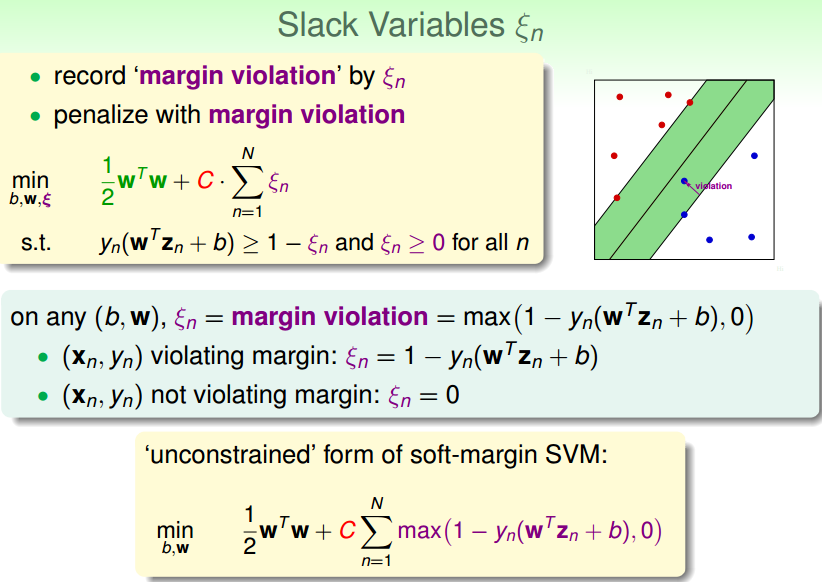

如上图所示，我们的soft-margin SVM引入了一个松弛变量ξn，用于记录每个点违反边界的大小，然后我们把它写成一个有条件的最佳化问题，最后想办法转成一个对偶问题来解决。过程大家都很熟悉了。

我们也可以从另一个角度来看看soft-margin到底做了什么事情。对于一个给定的点的ξn，要么大于0（有违反），要么等于0（没有违反），所以我们的ξn可以用图中的新形式来表示

由于ξn可以用一种新形式来代替，所以我们的soft-margin SVM又可以写为如上图中的那种无限制的最佳化形式。

那么有了这个式子之后，有什么好处呢？

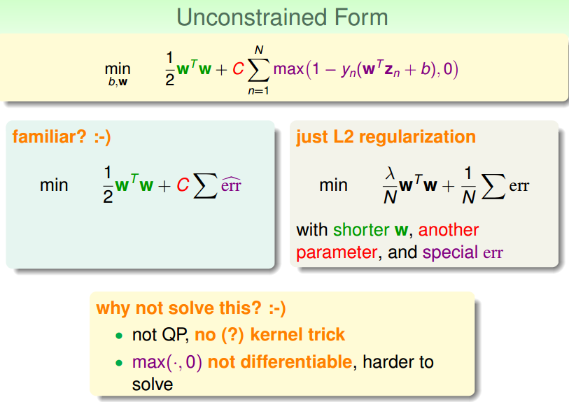

我们仔细来看这个新的最佳化的式子，左边是一个w的长度的表示，右边是一种error的衡量，这种形式是不是很熟悉，对，这就是我们学过的L2 regularization的形式。有一些小的不同的地方是：

* SVM使用C来进行参数控制，而L2 regularization使用λ来控制
* SVM的w的长度不包括b，而L2 regularization包括

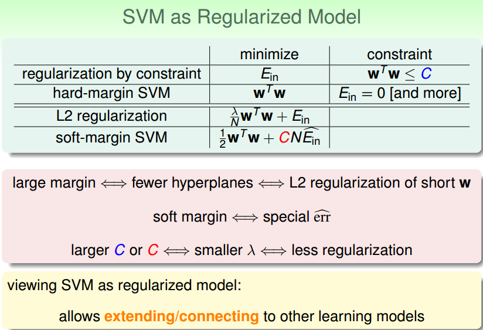

之前我们已经说过hard-margin SVM和受条件限制的regularization很像。现在这个关系更进一步了，我们将soft-margin SVM和L2 regularization来做比较，发现两种形式非常接近，只不过用了不同的参数(C,λ)来控制相同的事情罢了。

为什么要把SVM看成一种regularization模型？因为我们想把SVM延伸到其他问题上，

## 2. SVM vs Logistic regression

### 2.1 SVM like L2 regularization logistics regression

对于我们新的SVM的形式，它的error measure是一种Max(...)的形式，我们就来看看他的Error measure和二元分类的Err0/1有什么关系？

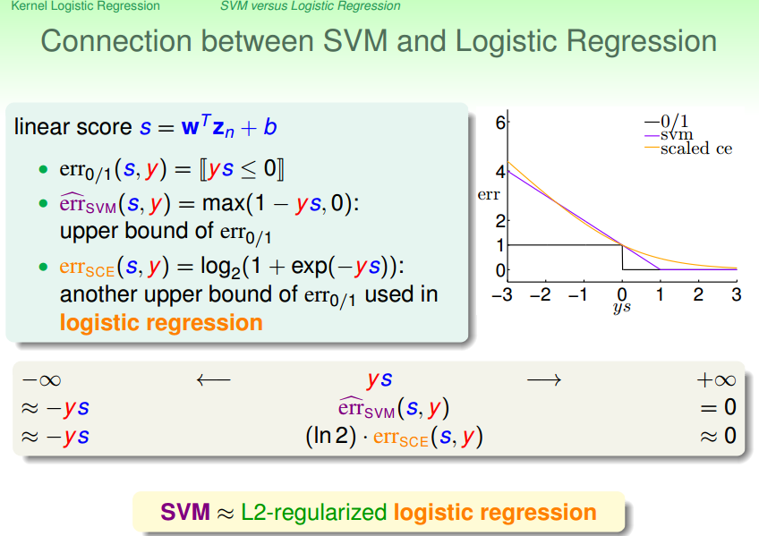

如上图所示，其中横坐标表示y乘以分数值。纵坐标代表错误值为多少。图中的黑色阶梯图形是0/1分类错误的图形。图中紫色的分段的直线代表SVM的错误衡量的图像。从图像中我们可以看出SVM的error measure更像是0/1 error的一个上限。我们一般在文献中管SVM使用的这种error measure叫做hinge error measure（像是把两扇门连起来的error measure）。

我们之前也将过，对于已经scale的logistics regression error来说，它也是0/1 error的上限，黄色的那条曲线。

从图中可以看出SVM的hinge error和logistics regression用的Ece长得很像，他们两个在横轴的走势大概一致。

所以说了那么多，就是为了说明SVM的error measure和logistics regression的error measure非常相似。

好的，首先，SVM和L2 regularization 的 logistics regression在目标函数中，同样都含有w长度的项。而且他们的error measure也如此相似。那我们就可以说其实SVM就是一种L2-regularization的logistics regression。

### 2.2 用于分类的线性模型

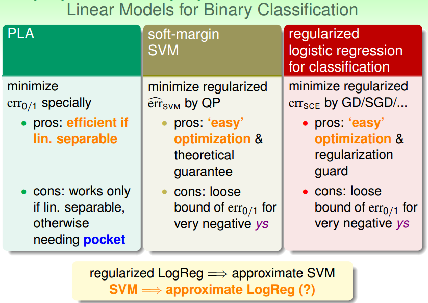

课程到现在，我们有多种线性模型可以用于二分类了。

PLA----

优点：
* 直接衡量0/1error，非常快速

缺点：
* 只有在线性可分的情况下才可以用PLA，否则要使用pocket，但是实际上pocket并不是特别好用。

regularized logistics regression----

优点：
* 目标函数易于优化，且加了正则项，有了模型复杂度上的保护

缺点：
* 只是一个0/1 error的上限而已

soft-margin SVM----

优点：
* QP问题依然很好优化，而且有了large的保证

缺点：
* 和logistics regression一样，只是在最佳化一个error 0/1的上限而已

因为我们的logistics regress可以用于分类，所以我们做了一个regularization的logistics regression的分类问题就相当于做了一个SVM的分类问题。

那我们现在反过来还成立么？那如果我们现在有一个需求，我们做了SVM，但是我们并不是想预测输入的数据是正类还是负类，我们是想像logistics regression一样预测数据属于某个类别的几率为多大？那如果我得到了SVM的解，那么可以说我几乎也得到了logistics regression的解吗？下一节继续。。。

## 3. SVM for binary classification

我们就继续上一节的问题，看看怎么把SVM用于soft的二元分类（也就是说输出的不是0/1分类的值，输出的是1类的概率值）。

### 3.1 简单的想法

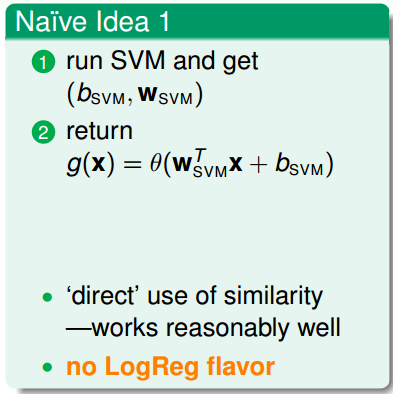

相信大家的第一直接就是这个想法。既然SVM和logistics regression这么像，那么我首先用SVM来计算出最佳的w和b，然后直接代入logistics regression的假设函数里面作为结果返回。

* 这种方法直接使用了SVM和logistics regression的相似性，在实际上通常表现的还不错
* 但是这种方法里面就几乎丧失了logistics regression的特点了(maximum likelihood)

### 3.2 另一种想法

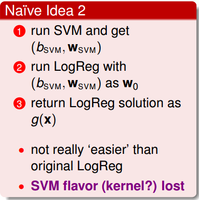

既然第一种方法没有logistics regression的特点，那么我就要做一些maximum likelihood的这样的一些learning的动作。所以依然运行SVM得到一个解，我把这个解当做logistics regression的gradient descend的w的起始点，那这应该是个还不错的起始点，最后应该能够比较快的得到最佳解。

* 这种方法其实和直接跑logistics regression的解其实是差不多的，这种方法就没有了SVM的特点了。

### 3.3 probabilistic SVM

该方法结合上述两种方法的特点来做。

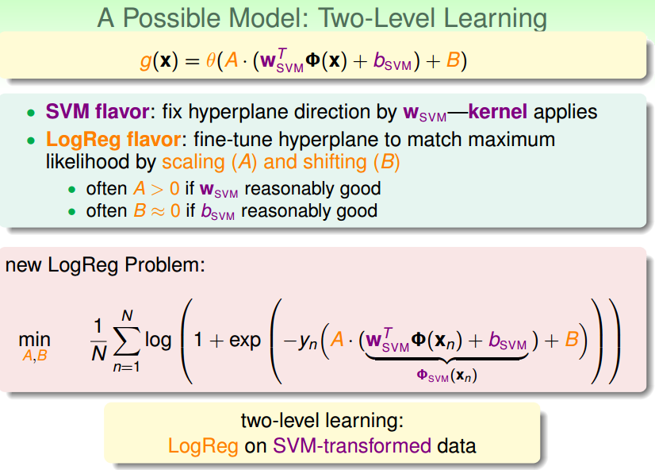

* 我们依然可以先使用SVM算出来w和b，相当于固定我们的最终的hyperplane的方向量的方向。保留了SVM的特点
* 第一步相当于更具w和b算出了一个分数，如果我们想使用logistics regression的特点，我们可以在这个分数的基础上加上两个自由度，一个用于放缩A，另一个用于平移B。我们再在这两个参数上做logistics regression的训练，使其保留logistics regression的特点。

通常，如果我们的结果A > 0的话，证明我们一开始SVM做得还是不错的。如果SVM做得好的话，B应该接近0。

所以说我们新的logistics regression问题就变成了上图的形式。看似复杂，如果我们把这个新的形式分成两步来看的话，就十分简单。

* 第一步使用SVM求出w,b，然后再将括号中关于w和b的部分当做常数来看待，就好似这个常数是经过SVM转换的常数。
* 那剩下的问题就是一个2个变量的logistics regression的问题。

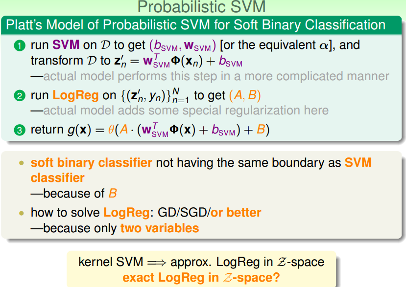

我们管这种方法叫做probabilistic SVM，这在SVM这个领域是一个非常常用的方法，将SVM应用于soft binary classification。这个方法是platt提出来的。

他的方法其实和我们上面描述的过程差不多

* 首先运行SVM得到b,w，然后再利用w,b将我们的data转换乘一个分数。在实际的platt的模型中可能还会对这个分数进行一些加工。
* 然后再在新的数据集中运行logistics regression来得到A和B，在实际的platt模型中还会加入一定的regularization来减少过拟合的风险。
* 返回一个logistics regression模型。

soft binary classifier可能和SVM拥有不一样的超平面，因为参数B可能会使SVM的超平面在做logistics regression的时候发生平移。

这个新的logistics regression的优化算法有很多，可以使用SGD,GD等

## 4 kernel logistic regression

### 4.1 如何才能使用kernel

想要将kernel应用于logistics regression。对于SVM，由于SVM的对偶问题存在Z空间的内积，所有我们可以使用kernel技巧。但是logistics regression不是一个QP问题，不是二次式，不是二次式的话那就没有Z空间的内积。

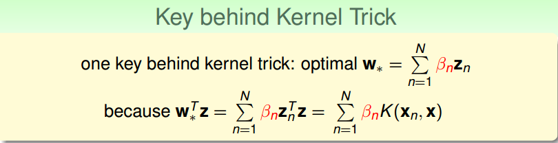

其实kernel trick就是把Z的内积换成在X空间可以计算的函数嘛，什么时候要用到Z空间的内积？我们在训练的时候需要算一些值要用到Z空间内积，更特别的是我们在做预测的时候也需要计算Z空间的内积（WZ）。那如果我的W可以表示为一堆Z的线性组合，那我才能够把计算WZ的动作表示成kernel function。所以W是一堆Z的线性组合使我们可以使用kernel的关键。

之前我们已经告诉过了一些算法，他的最佳的W是一堆Z的线性组合。比如下图：

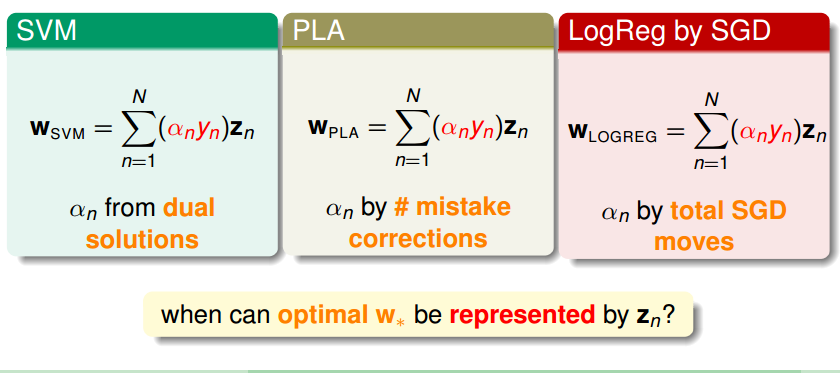

SVM不必多说。

PLA，的w是来自于我们每一个分类错误的点来参与的修正过程得到的。

使用SGD/GD的logistics regression也有这样的性质，可以通过logistics regression的w更新过程看出来，最终的w实际上是由zn的线性组合加起来的。

我们之前把这个结果叫做最好的W能够用Z表达出来。那什么时候最好的W能够用这些Z表达出来呢？

### 4.2 representer theorem

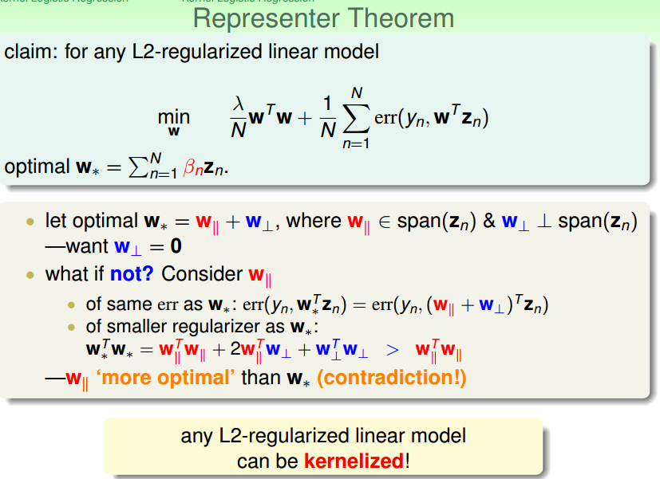

接着上一小结的问题，什么时候最好的W能够用Z表达出来呢？我们在数学上有一个结论，如上图，任意使用了L2 regularization的linear model的最佳解都能够用Z的线性组合表达出来。我们管这个理论叫做representer theorem。证明略。

### 4.3 kernel logistics regression

上面我们讨论了logistics regression使用kernel的可能性。现在我们来讨论在logistics regression上如何使用kernel。

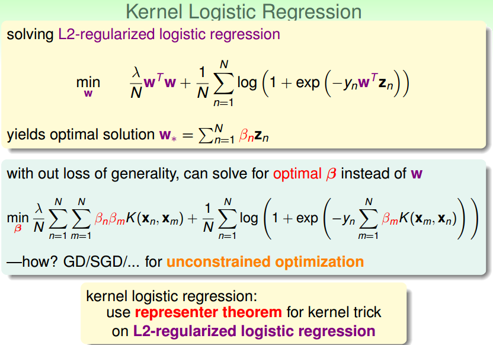

根据之前的representer theorem我们知道，最优的w是Z的线性组合。所以既然是这样，那我们就不求W了，我们改求那个线性组合的系数β。

首先将W用β的形式代入cost function中，接下来只需要求解beta就好了。beta的长度是样本的个数，和我们Z空间的长度就没有关系了。

我们的新的kernel logistics regression是一个没有条件的最佳化问题，使用GD/SGD都可以解决。

